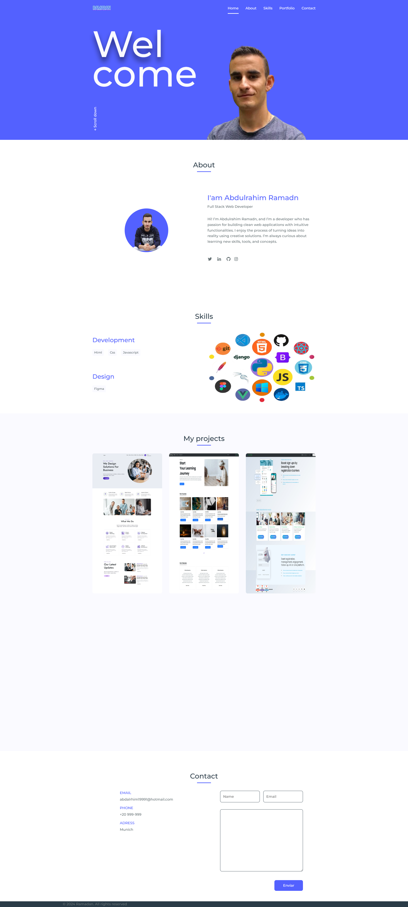

# My personal page ⭐

Welcome to my personal page repository! This is a simple website showcasing information about myself, my projects, skills, and interests. Feel free to explore and learn more about me.

## Features

- **About Me:** A brief introduction about myself, including my background, education, and interests.
- **Projects:** Showcase of my recent projects with descriptions and links to their respective repositories or live demos.
- **Skills:** Overview of my technical skills and areas of expertise.
- **Contact:** Ways to get in touch with me, such as email, social media links, or contact forms.

## Live Demo

You can view the live demo of my personal page [here](https://abdulrahim-ramadan.github.io/My-personal-page/).

## Screenshots




## Technologies Used

- **HTML:** Markup language used for structuring the web page content.
- **CSS:** Styling language used for designing the layout and appearance of the web page.
- **JavaScript:** Scripting language used for adding interactivity and dynamic behavior to the web page.
- **Bootstrap:** Front-end framework used for building responsive and mobile-first websites.
- **GitHub Pages:** Hosting service used for deploying the website.

## Installation

To deploy your own personal page, follow these steps:

1. **Clone the Repository:**

   ```bash
   git clone https://github.com/abdulrahim-ramadan/My-personal-page.git
   ```

2. **Customize Content:**

   Edit the HTML and CSS files to personalize the content, such as updating the About Me section, adding your own projects, and modifying the styling to fit your preferences.

3. **Deploy to GitHub Pages:**

   If you'd like to host your personal page on GitHub Pages, simply push your changes to a branch named `gh-pages`:

   ```bash
   git checkout -b gh-pages
   git push origin gh-pages
   ```

   Your personal page will then be accessible at `https://<username>.github.io/My-personal-page/`.

## Contributing

Contributions are welcome! If you have any suggestions, improvements, or bug fixes, please open an issue or submit a pull request.

## License

This project is licensed under the [MIT License](LICENSE).


## Please ⭐ the repo to support our project
